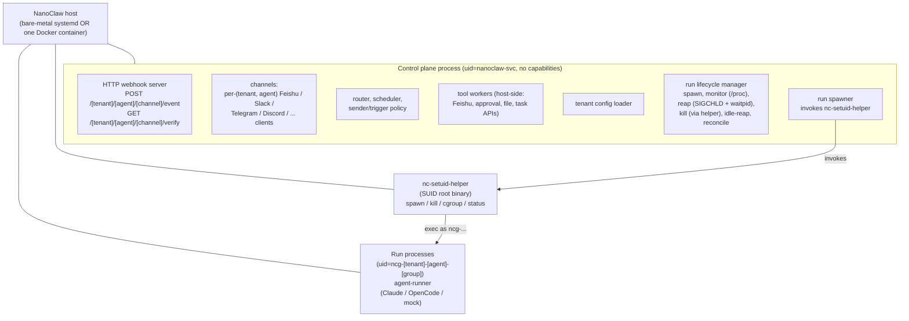
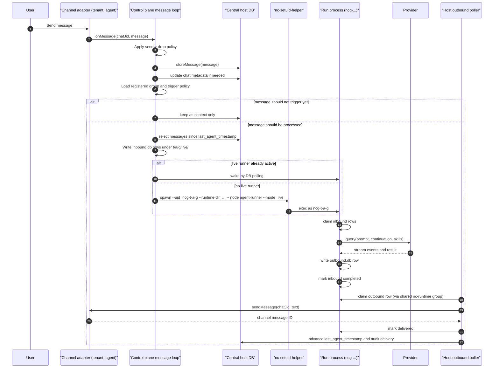
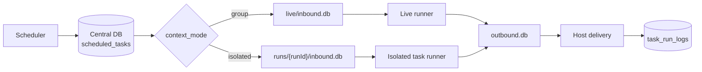
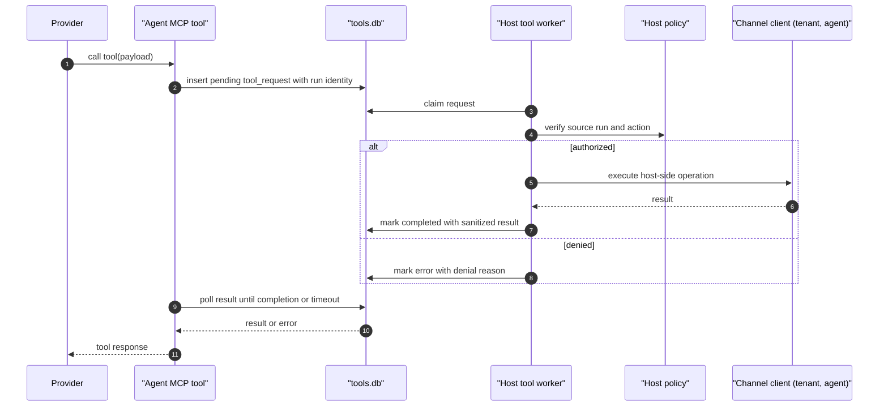
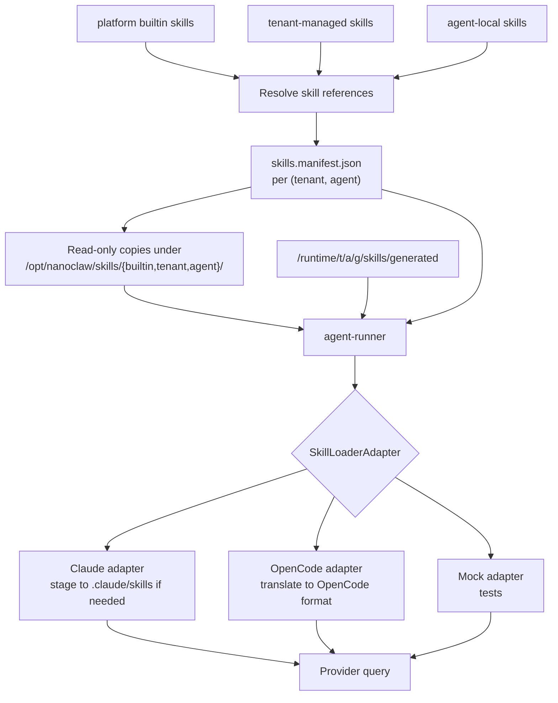
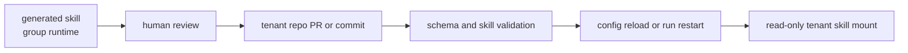

# Target Architecture Details

This document expands the NanoClaw 2.0 target architecture. It is the reference for how the runtime is wired, how messages move through the system, and how tenant configuration, channels, and skills are deployed and loaded.

For the design rationale behind these decisions, see [`../superpowers/specs/2026-06-16-multi-tenant-host-direct-isolation-design.md`](../superpowers/specs/2026-06-16-multi-tenant-host-direct-isolation-design.md). For individual decisions, see [ADR.md](./ADR.md).

## Architecture Overview



The overview collapses to a vertical spine: control plane → helper → run processes. Auxiliary planes (channel connections, tool workers, scheduler) live alongside the control plane.

## Component Responsibilities

### Control plane process

The control plane runs as `uid=nanoclaw-svc` with no Linux capabilities. It:

- Receives channel events via per-(tenant, agent) channel instances.
- Receives inbound webhooks via the shared HTTP server.
- Stores authoritative message history in the central host DB.
- Applies sender allowlists, trigger rules, card-action routing, main-group privileges, approval allowlists, mount allowlists.
- Owns `registered_groups`, task state, router cursors, channel metadata.
- Loads tenant and agent config from `NANOCLAW_TENANTS_DIR`, resolves skill manifests.
- Spawns, monitors, reaps, and kills run processes via `nc-setuid-helper`.
- Runs host-side tool workers for channel, Feishu, approval, file, and task operations.
- Holds provider and channel credentials in memory; reads them from `0600` files at startup.
- Exposes a reporter/local API for monitoring.

### nc-setuid-helper

The helper is a SUID root C binary installed at `/usr/lib/nanoclaw/nc-setuid-helper` (mode 4750, owner=root, group=nc-priv). Only `nanoclaw-svc` (the sole member of `nc-priv`) can invoke it. It exposes four operations:

```
nc-setuid-helper spawn  --uid=<u> --gid=<g> --cgroup=<path> --runtime-dir=<dir> -- <cmd...>
nc-setuid-helper kill   --pid=<p> --signal=<sig>
nc-setuid-helper cgroup --path=<path> --mem=<mb> --pids=<n> --cpu=<shares>
nc-setuid-helper status --pid=<p>
```

Validation:

- `--uid` and `--gid` must match `^ncg-` and correspond to a user recorded in `/var/lib/nanoclaw/users.db` (owned by root, mode 0600).
- `--runtime-dir` must be owned by `--uid:--gid` and live under `/var/lib/nanoclaw/runtime/`.
- `kill --pid` must target a process whose real UID matches an `ncg-*` user.
- `cgroup` paths must live under `/sys/fs/cgroup/nanoclaw/`.

Any violation: the helper exits non-zero without performing the operation. The control plane sees the failure and reports it.

After `spawn`, the exec'd process has dropped all capabilities and runs with the requested UID/GID.

### Run process

Each run process is the agent-runner invoked with a specific runtime directory. It:

- Runs as `ncg-<tenant>-<agent>-<group>`.
- Reads inbound work from its `inbound.db`.
- Invokes the configured provider with the resolved skill manifest and group-generated skills.
- Writes outbound responses and tool requests to its DBs.
- Exits on completion (isolated task) or after idle timeout (live runner).

## Privilege and Access Model

### Process ownership

| Process | UID | GID | Supplementary | Capabilities |
|---------|-----|-----|---------------|--------------|
| Control plane | `nanoclaw-svc` | `nanoclaw-svc` | `nc-runtime`, `nc-priv` | none |
| nc-setuid-helper (during execution) | root (via SUID) | root | — | CAP_SETUID, CAP_SETGID, CAP_KILL, CAP_SYS_ADMIN (for cgroup writes); dropped before exec |
| Run process | `ncg-<t>-<a>-<g>` | `ncg-<t>-<a>-<g>` | none | none |

### Filesystem access

- `/var/lib/nanoclaw/` — owned by `nanoclaw-svc`, mode 0755.
- `/var/lib/nanoclaw/users.db` — owned by root, mode 0600. Only the helper accesses this.
- `/var/lib/nanoclaw/auth/tenants/<t>/<a>/<channel>/credentials.json` — owned by `nanoclaw-svc`, mode 0600.
- `/var/lib/nanoclaw/runtime/<t>/<a>/<g>/` — owned by `ncg-<t>-<a>-<g>:nc-runtime`, mode 0770.
- `/opt/nanoclaw/agent-runner/` — owned by `nanoclaw-svc`, mode 0755. World-readable (run processes read platform code).
- `/opt/nanoclaw/skills/` — owned by `nanoclaw-svc`, mode 0755. World-readable (read-only skill inputs).

### The `nc-runtime` group

Group `nc-runtime` exists with **only** `nanoclaw-svc` as a member. Every runtime directory is `owner=ncg-<t>-<a>-<g>`, `group=nc-runtime`, `mode=0770`.

- Owner (the ncg user) gets rwx.
- Group (only `nanoclaw-svc`) gets rwx — control plane reads/writes IPC files transparently.
- Other `ncg-*` users fall to "other" → no access.

This gives the control plane transparent access to every runtime dir without elevating through the helper, while keeping `ncg-*` users fully isolated from each other.

## User Model

### Naming

Linux user name format: `ncg-<tenant>-<agent>-<group>`.

Sanitisation:

- All segments lowercased.
- Allowed characters: `[a-z0-9-]`. Anything else replaced with `-`.
- Tenant and agent IDs: max 16 chars each, validated at tenant-config load time.
- Group ID: variable length, sanitised to `[a-z0-9-]+`. If the resulting username would exceed 32 chars, the group segment is replaced with `g<sha1(group).substr(0,8)>`.

### Lifecycle

Users are created lazily by the helper on first run for a given (tenant, agent, group) tuple, and **never deleted automatically**. Idle runs stop the process but keep the user and runtime directory on disk so the next message has a warm path. A separate `nanoclaw-user-gc` admin command can prune users for tenants removed from config; this is operator-driven.

State file `/var/lib/nanoclaw/users.db` (SQLite, root:root 0600) tracks every user the helper has created.

## Runtime Units and Data Ownership

| Unit | Definition |
|------|------------|
| Tenant | Deployment, configuration, and skill-management layer. May own multiple agents. Not a runtime isolation unit. |
| Agent service | One configured (provider, model, instructions, skills, channels, limits) tuple. May own multiple groups. |
| Group | One Linux user `ncg-<t>-<a>-<g>` inside the host. One live runtime directory. Zero or more isolated task runtime directories. Group-local generated skills and memory. |
| Run | One live or isolated process lifecycle. One set of runtime DBs. One provider continuation namespace. |

## Runtime Directory Layout

Host path:

```text
/var/lib/nanoclaw/
  users.db
  auth/
    tenants/
      <tenant>/<agent>/<channel>/credentials.json
  runtime/
    <tenant>/<agent>/<group>/
      live/
        inbound.db
        outbound.db
        state.db
        tools.db
        files/
        downloads/
      runs/<runId>/
        inbound.db
        outbound.db
        state.db
        tools.db
        files/
        downloads/
      skills/
        generated/
  logs/
    <tenant>/<agent>/<group>/
      live.log
      runs/<runId>.log
```

Run process view (cwd and home):

- `/var/lib/nanoclaw/runtime/<t>/<a>/<g>/{live|runs/<runId>}/` — read/write own DBs, files, generated skills.
- `/opt/nanoclaw/skills/{builtin,tenant/<t>,agent/<t>/<a>}/` — read-only.
- `/opt/nanoclaw/agent-runner/` — read-only platform code.

Cannot see:

- Other tenants/agents/groups runtime directories.
- `auth/` and `users.db`.
- Tenant repo source files (loaded only into control plane memory; run process gets a resolved skill manifest copy under its own runtime dir).

## Tenant Configuration

### Source

All tenant and agent configuration is loaded from a tenant repository on startup via `NANOCLAW_TENANTS_DIR`. The loader validates schemas, resolves skill references, and produces in-memory `RegisteredTenant` / `RegisteredAgent` objects.

### Layout

```text
nanoclaw-tenants/
  tenants/
    <tenant>/
      tenant.json
      skills/
        <skill>/
          SKILL.md
          manifest.json
      agents/
        <agent>/
          agent.json
          instructions.md
          skills/
          channels/
            feishu.json
            slack.json
            telegram.json
```

### `agent.json` example

```json
{
  "id": "finance",
  "tenant": "acme",
  "name": "Finance Bot",
  "provider": "claude",
  "model": "claude-sonnet-4",
  "instructions": "./instructions.md",
  "skills": [
    "builtin:welcome",
    "tenant:acme-approval",
    "agent:finance-local"
  ],
  "channels": ["feishu"],
  "envRefs": ["ANTHROPIC_API_KEY"],
  "limits": {
    "memoryMb": 1024,
    "pids": 256,
    "concurrentTasksPerGroup": 1
  }
}
```

### `channels/feishu.json` example

```json
{
  "mode": "websocket",
  "appId": "cli_acme_finance",
  "appSecretRef": "FEISHU_APP_SECRET",
  "webhook": {
    "encryptKeyRef": "FEISHU_WEBHOOK_ENCRYPT_KEY",
    "verificationTokenRef": "FEISHU_WEBHOOK_VERIFICATION_TOKEN"
  }
}
```

Secret values live in `store/auth/tenants/<tenant>/<agent>/feishu/credentials.json` (0600, owner=nanoclaw-svc). The repo carries only references.

## Channel Registry and Webhook Routing

### Registry key

Channel registry uses composite key `(tenant_id, agent_id, channel_type)`. For each `agent.json` that declares a channel, the loader constructs a channel instance with that agent's external identity and registers it. Lookup goes through `getChannel(tenantId, agentId, channelType)`.

### Inbound webhook server

Control plane runs **one** HTTP server. Each channel instance registers its URL prefix:

```text
POST /<tenant>/<agent>/feishu/event       → FeishuChannel(tenant, agent).handleWebhook
POST /<tenant>/<agent>/slack/event        → SlackChannel(tenant, agent).handleWebhook
GET  /<tenant>/<agent>/<channel>/verify
```

For channels using outbound connections (Feishu WebSocket mode, Slack Socket Mode, Telegram long-poll), each channel instance owns its connection. NanoClaw identifies the source tenant/agent by which connection the event arrived on.

### Channel client inheritance

`FeishuClient` (and equivalents) are constructed per-instance with their own credentials and are state-safe for multiple instances in one process. No module-level mutable state.

## Normal Message Processing Flow



Key rules:

- The central host DB remains authoritative for source message history and cursors.
- Runtime inbound rows carry source message IDs for idempotent retry.
- If a run fails before user-visible output is delivered, the host rolls back `last_agent_timestamp[chat_jid]`.
- If output was delivered and a later provider error happens, the host does not roll back the cursor.
- Active follow-up messages are written as new inbound rows.

## Scheduled Task Flow

Group-context scheduled task:

1. Scheduler reads due tasks from the central host DB.
2. Host formats the task as a synthetic inbound message for the target group.
3. Host uses the same live runtime path as normal messages.
4. The task can use existing live conversation continuation.
5. Task result is delivered through the host outbound poller.

Isolated scheduled task:

1. Scheduler reads due task from the central host DB.
2. Host creates `runs/<runId>/` under the group runtime directory.
3. Host writes the task prompt to that run's `inbound.db`.
4. Helper starts an `isolated-task` runner as the same group Linux user.
5. Runner does not read live conversation history or live continuation.
6. Runner exits after result or error.
7. Host records `task_run_logs` and updates `scheduled_tasks`.



## Tool Request Flow

Tools are invoked by provider-visible MCP tools, but host capabilities remain host-side.



Tool workers validate the source runtime identity rather than trusting group IDs inside the request payload. The worker uses `getChannel(tenantId, agentId, channelType)` to pick the correct channel instance. File tools return runtime file IDs or container paths under the run directory, not host paths.

## Skill Deployment and Loading Flow

Resolved skills become read-only inputs to the run. Group-generated skills are appended at run start.



Loading steps:

1. Tenant loader resolves `builtin:`, `tenant:`, and `agent:` references at startup.
2. Control plane copies resolved skills into `/opt/nanoclaw/skills/{builtin,tenant/<t>,agent/<t>/<a>}/` (or mounts them, in container deployments).
3. Control plane writes a normalized `skills.manifest.json` into each run's runtime dir at spawn time.
4. Run process reads the manifest and resolves the group generated skill root.
5. Provider-specific `SkillLoaderAdapter` prepares provider-native skill paths.
6. Provider query runs with the prepared skill configuration.

## Skill Authoring and Promotion Flow

Group-generated skill:

1. Run process or reporter/local API writes under `/var/lib/nanoclaw/runtime/<t>/<a>/<g>/skills/generated/<skill>/`.
2. Only that group user (and the control plane via `nc-runtime`) can read/write it.
3. The skill is visible to future runs for that group.
4. It is not copied into the tenant repository automatically.

Promotion to tenant skill:



Promotion must be explicit so tenant repositories remain the source of truth for shared business behavior.

## Failure and Recovery Behavior

### Control plane restart

- Central DB retains messages, tasks, groups, and cursors.
- Runtime DB rows remain on disk.
- Control plane scans pending inbound/outbound rows and central cursor state.
- DB-listed active run PIDs are checked against `/proc/`; missing ones marked crashed and reconciled.

### Run process crash

- Control plane detects via SIGCHLD and `waitpid`.
- Runtime directory preserved (no automatic cleanup).
- Pending inbound rows remain claimable by the next live runner.
- Pending outbound rows remain deliverable.

### Provider failure

- Provider adapter emits structured error.
- Inbound rows are marked `error` or returned to `pending` according to retry policy.
- Host cursor rollback follows the "output delivered or not" rule.

### Tool worker failure

- Pending tool rows are retryable until timeout.
- Claimed rows older than a lease timeout return to pending or become timeout.
- Denied requests complete with explicit tool errors.

## Operational Status View

The status command should report:

- Control plane process health.
- Connected channels per (tenant, agent).
- Central DB path and cursor summary.
- Configured tenants and agent services.
- Active run count per (tenant, agent, group).
- Runtime DB queue depths.
- Per-group user and permission checks.
- Skill manifest revisions per agent.
- Helper health and recent invocations.
- Migration state (post-cutover verify).

## Future Extensions

Documented in the spec; not part of initial implementation:

- **Approach A**: Separate supervisor process that owns user lifecycle and run spawning. Shrinks the privilege surface further.
- **Per-run Unix socket credential proxy**: If NanoClaw ever runs untrusted tenants, upgrade credential delivery from env injection to per-run Unix sockets with kernel-enforced access control.
- **Skill hot-reload**: Add `skills.reload` to the run lifecycle so tenant skill changes take effect without restarting active runs.
